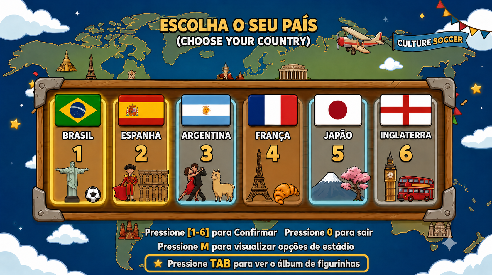
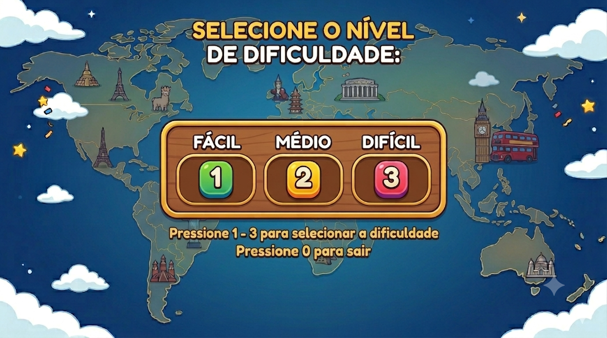
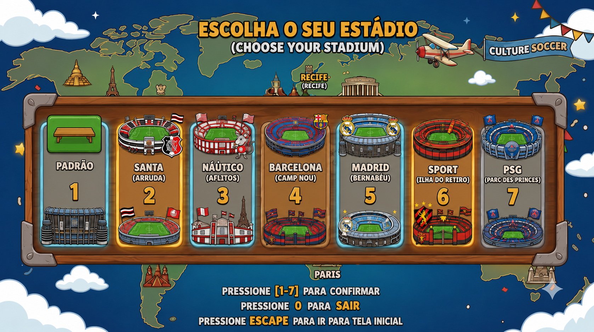
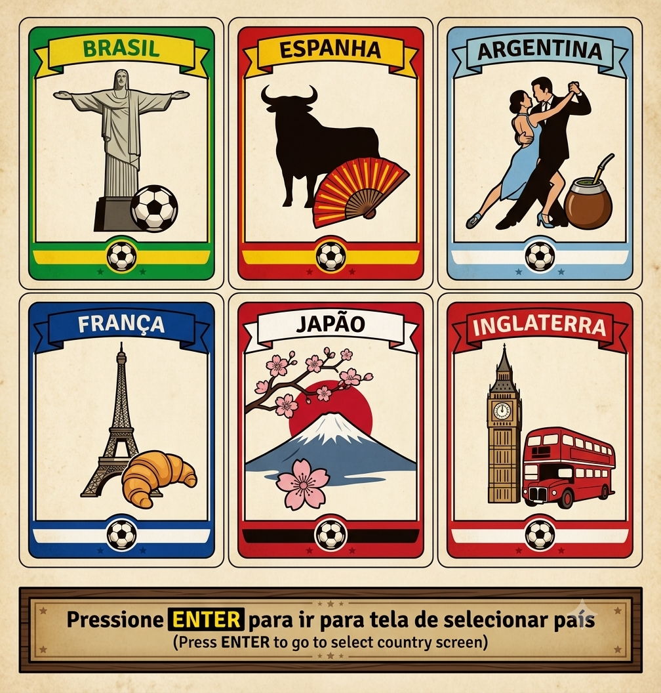
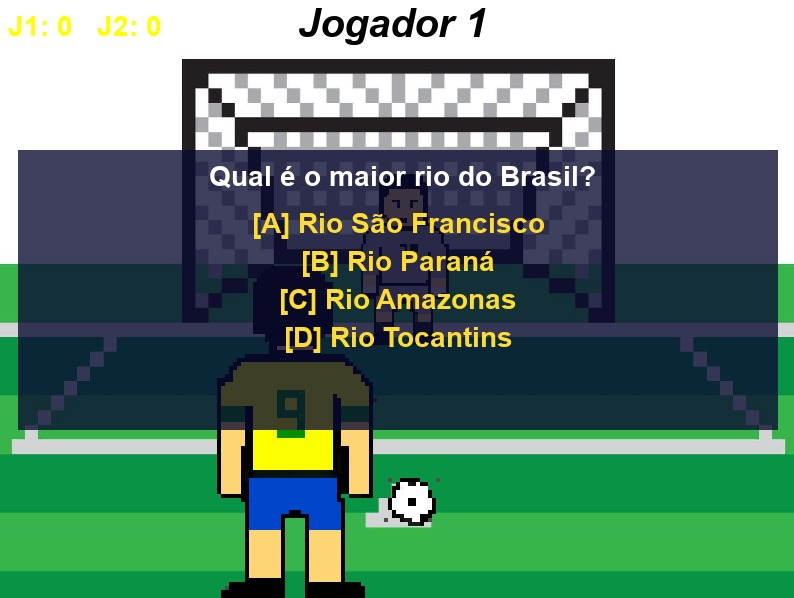
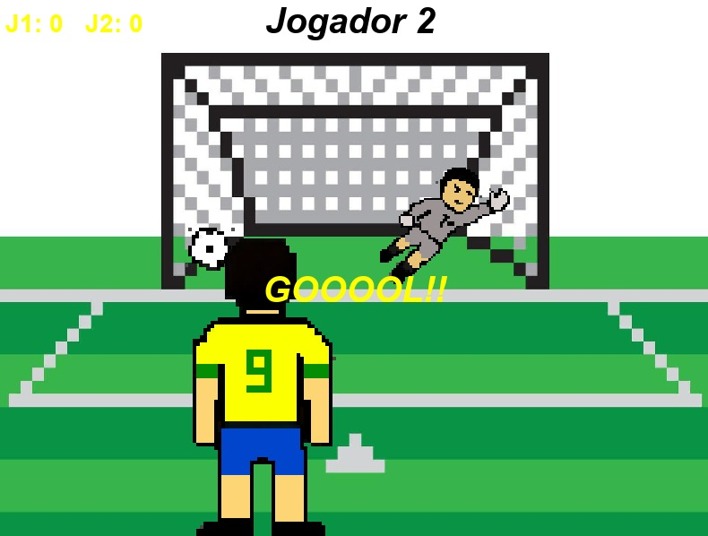

# ⚽ Culture Soccer

**Culture Soccer** é um jogo competitivo local para dois jogadores que une conhecimentos gerais sobre a cultura mundial com a emoção de uma disputa de pênaltis. Responda corretamente para ganhar o direito de cobrar o pênalti, desafie um amigo e descubra quem é o verdadeiro mestre do campo (e dos livros)!

Repositório original: [thuliobandeira402/Culture-Soccer](https://github.com/thuliobandeira402/Culture-Soccer)


---

## 📑 Sumário

- [Sobre o projeto](#-sobre-o-projeto)
- [Capturas de tela](#-capturas-de-tela)
- [Pré-requisitos](#-pré-requisitos)
- [Instalação](#-instalação)
- [Como executar](#-como-executar)
- [Como jogar](#-como-jogar)
- [Estrutura do projeto](#-estrutura-do-projeto)
- [Banco de dados do álbum](#-banco-de-dados-do-álbum)
- [Solução de problemas](#-solução-de-problemas)
- [Funcionalidades](#-funcionalidades)
- [Contribuindo](#-contribuindo)
- [Licença](#-licença)
- [Autor](#-autor)

---

## 🚀 Sobre o projeto

O jogo foi desenvolvido em **Python** utilizando a biblioteca **Pygame**, e roda inteiramente de forma local (sem necessidade de internet ou servidor). A dinâmica é dividida em dois momentos principais:

1. **O desafio intelectual** — os jogadores escolhem uma seleção e respondem perguntas de múltipla escolha sobre a cultura do país selecionado.
2. **A decisão no campo** — quem acerta a pergunta ganha o direito de cobrar um pênalti animado contra o oponente, que assume o papel de goleiro.

Ao longo das partidas, os jogadores também desbloqueiam **figurinhas de países** em um álbum persistente, salvo em um banco de dados local.

---

## 🖼️ Capturas de tela

<table>
  <tr>
    <td align="center" width="33%">
      <br/>
      <sub><b>Tela inicial</b></sub>
    </td>
    <td align="center" width="33%">
      <br/>
      <sub><b>Seleção de país</b></sub>
    </td>
    <td align="center" width="33%">
      <br/>
      <sub><b>Seleção de dificuldade</b></sub>
    </td>
  </tr>
  <tr>
    <td align="center">
      <br/>
      <sub><b>Seleção de estádio</b></sub>
    </td>
    <td align="center">
      <br/>
      <sub><b>Álbum de figurinhas</b></sub>
    </td>
    <td align="center">
      <br/>
      <sub><b>Pergunta de cultura</b></sub>
    </td>
  </tr>
  <tr>
    <td align="center" colspan="3">
      <br/>
      <sub><b>GOOOOL! Cobrança de pênalti em campo</b></sub>
    </td>
  </tr>
</table>

---

## ✅ Pré-requisitos

Antes de instalar o jogo, certifique-se de ter:

- **Python 3.8 ou superior** instalado ([download oficial](https://www.python.org/downloads/)).
- **pip** (gerenciador de pacotes do Python, já incluído na maioria das instalações do Python).
- **Git** (opcional, apenas se for clonar o repositório em vez de baixar o `.zip`).

Para verificar se o Python e o pip já estão instalados, rode no terminal:

```bash
python --version
pip --version
```

> 💻 No Windows, talvez seja necessário usar `python3` e `pip3` no lugar de `python` e `pip`, dependendo de como o Python foi instalado.

---

## 📥 Instalação

### 1. Obtenha o código

Clonando via Git:

```bash
git clone https://github.com/thuliobandeira402/Culture-Soccer.git
cd Culture-Soccer
```

Ou baixe o `.zip` do repositório e extraia em uma pasta de sua preferência.

### 2. (Recomendado) Crie um ambiente virtual

Isso evita conflitos com outras instalações de Python na sua máquina:

```bash
python -m venv venv
```

Ative o ambiente virtual:

```bash
# Windows
venv\Scripts\activate

# Linux / macOS
source venv/bin/activate
```

### 3. Instale as dependências

O jogo depende apenas da biblioteca **Pygame**:

```bash
pip install pygame
```

Se preferir, crie um arquivo `requirements.txt` na raiz do projeto com o conteúdo abaixo e instale tudo de uma vez:

```
pygame
```

```bash
pip install -r requirements.txt
```

---

## ▶️ Como executar

Com as dependências instaladas, rode o arquivo principal do jogo:

```bash
python game.py
```

Uma janela do Pygame deve abrir automaticamente com o menu inicial do **Culture Soccer**.

---

## 🎮 Como jogar

1. **Menu inicial:** pressione `ENTER` para começar.
2. **Seleção de país:** use as teclas numéricas de `1` a `6` para escolher sua seleção (Brasil, Espanha, Argentina, França, Japão ou Inglaterra). Pressione `M` para ver as opções de estádio ou `TAB` para visualizar o álbum de figurinhas.
3. **Seleção de estádio:** use as teclas numéricas de `1` a `7` para escolher o estádio da partida.
4. **Dificuldade:** escolha entre `1` (Fácil), `2` (Médio) ou `3` (Difícil).
5. **Perguntas:** utilize as teclas `A`, `B`, `C` ou `D` para responder às perguntas de múltipla escolha sobre a cultura do país escolhido.
6. **Cobrança de pênalti:**
   - **Chutador:** teclas `A` (esquerda), `S` (meio), `D` (direita).
   - **Goleiro:** teclas `H` (esquerda), `J` (meio), `K` (direita).

O jogo é estruturado em rodadas: cada acerto garante uma cobrança de pênalti, e quem fizer mais gols ao final das rodadas vence a partida.

---

## 🛠️ Estrutura do projeto

```
Culture-Soccer/
├── game.py                 # Arquivo principal: loop do jogo e lógica de estados
├── core/
│   └── personagens.py      # Criação e animação dos personagens/sprites
├── album/
│   ├── cards.py             # Lógica de exibição do álbum de figurinhas
│   └── database.py          # Persistência das figurinhas desbloqueadas (SQLite)
├── utils/
│   ├── utils.py              # Funções auxiliares (perguntas, respostas, sons, textos)
│   └── perguntas.json        # Banco de perguntas de cultura geral por país e dificuldade
├── images/
│   ├── menus/                 # Telas de menu (inicial, seleção de país, álbum, etc.)
│   ├── stadium/                # Fundos dos estádios disponíveis
│   └── sprites/                 # Spritesheet dos personagens e itens
├── audio/                  # Efeitos sonoros e trilha sonora de fundo
└── docs/
    └── screenshots/         # Imagens usadas neste README
```

---

## 🗄️ Banco de dados do álbum

As figurinhas desbloqueadas por cada jogador são salvas automaticamente em um banco **SQLite** local (`album.db`), criado na raiz do projeto na primeira execução do jogo. Não é necessária nenhuma configuração manual — o arquivo é gerado e atualizado pelo próprio `game.py`.

Se quiser reiniciar o progresso do álbum, basta apagar o arquivo `album.db`; ele será recriado vazio na próxima execução.

---

## 🩺 Solução de problemas

- **`ModuleNotFoundError: No module named 'pygame'`** → o Pygame não foi instalado no ambiente atual. Rode `pip install pygame` novamente, garantindo que o ambiente virtual (se criado) esteja ativado.
- **A janela do jogo não abre / fecha sozinha** → confirme que está executando o comando a partir da pasta raiz do projeto (`cd Culture-Soccer`), pois o jogo carrega imagens e sons por caminhos relativos.
- **Sem som no jogo** → verifique se o sistema possui um dispositivo de áudio configurado e se o volume não está mudo; o Pygame depende do mixer de áudio do sistema operacional.

---

## 🌟 Funcionalidades

- **Multiplayer local:** sistema de turnos entre Jogador 1 e Jogador 2.
- **Sistema de rounds:** partidas estruturadas em rodadas para definir o vencedor.
- **Animações dinâmicas:** sprites animados para seleções de diferentes países (Brasil, Espanha, Argentina, França, Japão e Inglaterra).
- **Escolha de estádio:** diversos estádios disponíveis como cenário da partida.
- **Álbum de figurinhas:** progresso persistente de países desbloqueados por jogador.
- **Feedback sonoro:** efeitos de cliques, gols e defesas, além de trilha sonora de fundo.

---

## 🤝 Contribuindo

Este é um projeto educacional e divertido! Sinta-se à vontade para:

- Adicionar novas perguntas ao banco de dados (`utils/perguntas.json`).
- Melhorar as físicas da bola e do goleiro.
- Implementar novos países, estádios e sprites.
- Reportar bugs ou sugerir melhorias através de uma *issue* no repositório.

Para contribuir, faça um fork do repositório, crie uma branch para sua alteração e abra um *pull request* explicando o que foi modificado.

---

## 📝 Licença

Distribuído sob a licença MIT. Veja o arquivo `LICENSE` para mais informações.

---
## Artigos
Rivan:https://1drv.ms/w/c/98255efd15439eb7/IQDpvyZn3ok7QInopUZu2J4uAWORElcZElSHQ5IJsOaqSKQ?e=MOxZmH

## 👤 Autores

Desenvolvido por [**thuliobandeira402**](https://github.com/thuliobandeira402), e [**rivanbarroso0**](https://github.com/rivanbarroso0).
